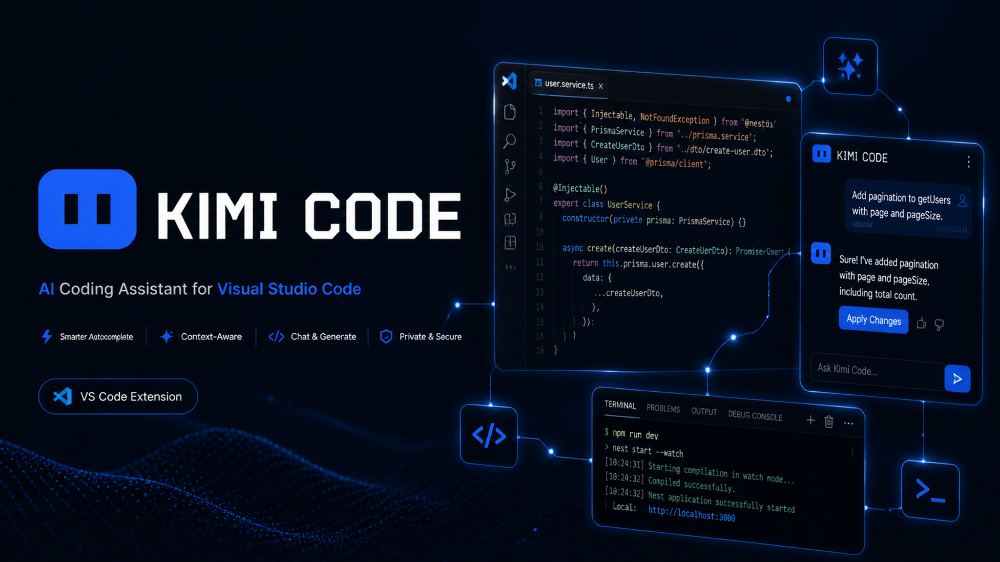

# Kimi Code VS Code 插件 —— 个人修改版(Fork)

<p align="center">
  
</p>

> **本仓库是 Moonshot AI 官方 Kimi Code VS Code 插件的第三方修改版(fork)。**
>
> **原版地址**: [MoonshotAI/kimi-code](https://github.com/MoonshotAI/kimi-code)(插件位于其 `apps/vscode` 子目录)
> 本仓库已从原版 monorepo 中**提取并精简**,仅保留构建本插件所需的代码。

## ⚠️ 声明

- 本插件是**个人定制修改版**,与官方版**完全隔离**:扩展 ID `moonshot-ai.kimicode-vscode-fork`、displayName "Kimi Code (Fork)",命令/设置前缀均为 `kimifork.*`,视图容器 `kimifork-sidebar`。可与官方版同时共存,互不冲突。
- 本项目**不隶属于 Moonshot AI**,不提供官方支持,使用风险自负。
- 原版仓库删除了与 VS Code 无关的部分(Kimi Code CLI/TUI、kimi-web、kap-server、vis 等);本仓库只包含 `apps/vscode` 插件及构建闭包内必需的 11 个私有内部包(它们不发布到 npm registry,是编译必需依赖)。

## 与原版的差异(定制内容摘要)

- **会话标题自动生成**:新对话不再以第一句话作标题,由 LLM 从需求提炼 3-6 词摘要,并支持手动重命名
- **额度状态栏**:5 小时 / 7 天额度同心环实时显示,颜色随用量变化(70% 起黄 → 100% 红),含重置倒计时与 Tooltip
- **Plan 审批(Claude 式 UX)**:Plan 模式弹窗支持 执行 / Revise+反馈 / 选项,不再在 YOLO 下静默直接执行
- **子代理自定义供应商**:可在 VS Code 内为子代理配置自定义供应商(密钥存 SecretStorage,安全)
- **界面 i18n**:中英文切换(设置 `kimifork.language`)
- **Logo 与视觉**:复刻 Kimi Code CLI 蓝色标识、对话框头像、状态栏布局调整
- **性能与稳定性**:历史记录长对话加载优化、上下文压缩后查看器、对话框防草稿回流、终止响应更可靠
- **Web 同款输入区**:后台 Bash / 子 Agent / 待办状态栏、模式与模型选择器(参考 kimi code web 界面)

## 构建与打包

环境要求:**Node.js >= 24.15.0**、**pnpm 10.33.0**(`engine-strict` 已启用,版本不满足会直接失败)。

```bash
pnpm install
cd apps/vscode
pnpm typecheck
pnpm build
node scripts/vsix-package.mjs win32-x64
```

产出:`apps/vscode/artifacts/vsix/kimi-code-win32-x64.vsix`

### 安装到 VS Code

解包 vsix 中的 `extension/` 子树到 VS Code 扩展目录(如 `~/.vscode/extensions/moonshot-ai.kimicode-vscode-fork-0.7.0`),然后执行 **`Developer: Reload Window`**。

> 注意:扩展菜单里的 "Reset Kimi" 只刷新 webview,不重载扩展宿主;修改代码后必须 Reload Window 才生效。

## 目录结构

```
apps/vscode/          # 插件源码(extension host + React webview UI + 打包脚本)
packages/             # 构建闭包内的 11 个私有内部包(编译必需,不发布)
build/                # 构建工具(raw-text loader 等)
scripts/              # postinstall(node-pty 修复)
```

## License

[Apache-2.0](apps/vscode/LICENSE),基于 Moonshot AI 原版修改。原版版权归 Moonshot AI 所有。
