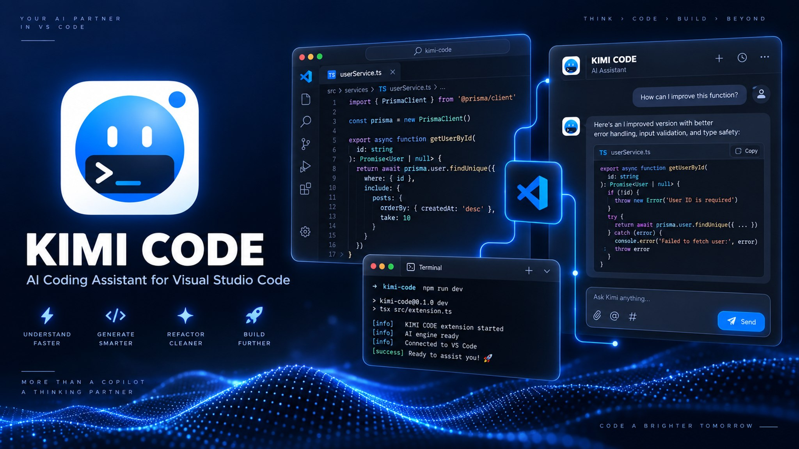
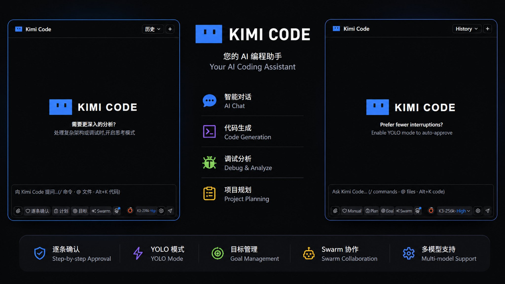

# Kimi Code VS Code 插件 —— 个人修改版 (Fork)

<p align="center">
  
</p>

> **本仓库是 Moonshot AI 官方 Kimi Code VS Code 插件的第三方修改版 (fork)。**
>
> - **原版地址**：[MoonshotAI/kimi-code](https://github.com/MoonshotAI/kimi-code)（插件位于其 `apps/vscode` 子目录）
> - 本仓库已从原版 monorepo **提取并精简**，仅保留构建本插件所需的代码。

<div align="center">

**最后更新：2026-08-19**

</div>

## ⚠️ 声明

- 本插件是 **个人定制修改版**，与官方版 **完全隔离**：扩展 ID `moonshot-ai.kimicode-vscode-fork`、displayName "Kimi Code (Fork)"，命令 / 设置前缀均为 `kimifork.*`，视图容器 `kimifork-sidebar`。可与官方版同时共存，互不冲突。
- 本项目 **不隶属于 Moonshot AI**，不提供官方支持，使用风险自负。
- 原版仓库删除了与 VS Code 无关的部分（Kimi Code CLI/TUI、kimi-web、kap-server、vis 等）；本仓库只包含 `apps/vscode` 插件及构建闭包内必需的 11 个私有内部包（它们不发布到 npm registry，是编译必需依赖）。
- 习惯用 VS Code 后被迫用了 5 小时额度，于是改了 VS Code 插件；加上目前官方主要在维护 bug、没有具体功能设置上的更新，所以根据不同人的使用需求增加了一些功能，方便对齐 Web 版本。

## ✨ 与原版的差异（定制功能）

### 🤖 会话与标题

- **会话标题自动生成**：官方V2引擎 已经添加该功能，官方默认关闭，我已经默认开启

### 📊 额度

- **额度状态栏**：5 小时 / 7 天额度同心环实时显示，颜色随用量变化（70% 起黄 → 100% 红），含重置倒计时与 Tooltip；额度查询固定走直连，不经系统代理，避免代理导致偶发查询失败

### 🛡️ 权限与审批

- **Plan 审批（Claude 式 UX）**：Plan 模式弹窗支持 执行 / Revise+反馈 / 选项，不再在 YOLO 下静默直接执行；计划完成时先在编辑器中打开计划文件，再弹窗确认

### 🧠 上下文

- **自动压缩上下文**：设置菜单开关（语言设置下方，默认关闭），任务结束后上下文超过 256K 时自动执行 `/compact`，防止 K3-256k 等 256K 模型上下文超限丢失
- **压缩后界面同步**：`/compact` 完成后对话列表与引擎真实上下文同步——压缩记录显示为 Claude Code 风格的单行标记（手动/自动 + 释放 token 数），点击可展开压缩摘要；上下文查看器打开时自动刷新

### 📜 历史记录

- **历史记录加载体验**：打开 / 切换历史对话立即显示加载遮罩；加载完成后直接定位到最新消息，不再有从上往下的滚动动画；点选会话后列表立即收起，不再挂在遮罩上
- **Kimi 眼睛加载动画**：历史加载、会话列表、上下文查看器等加载场景，居中显示毛玻璃加载胶囊——左侧 Kimi 眼睛徽标（左右漂移 + 眨眼，复刻 Kimi Web 左上角图标动画），右侧「加载中…」文案

### 🤝 子代理

- **子代理自定义供应商**：可在 VS Code 内为子代理配置自定义供应商（密钥存 SecretStorage，安全），支持添加 / 编辑（密钥留空保持不变）/ 删除
- **子代理独立模型（secondary model）**：子代理可绑定独立供应商模型（如 DeepSeek），主代理 Kimi + 子代理 DeepSeek 分流，高峰期更稳更快
- **子代理模型徽标**：使用第三方模型的子代理在卡片尾部标注紫色模型名徽标，跟随主模型的不标记（实时与历史回放均生效）

### 🌐 界面

- **界面语言：中英文切换（设置 `kimifork.language`）
- **Logo与视觉**：复刻 Kimi Code CLI 蓝色标识、对话框头像、状态栏布局调整；所有开关 开 = 蓝色 / 关 = 灰色，状态一眼可辨
- **Web 同款输入区**：状态行左侧保留队列 / 文件修改，右侧为后台 Bash / 子 Agent / 当前进度（待办）/ 上下文查看器（仅在本对话调用过后显示）；模式与模型选择器（参考 kimi code web 界面）；有待发消息时队列按钮蓝色高亮

### ⚡ 性能与稳定性

- **性能与稳定性**：历史记录长对话加载优化、上下文压缩后查看器、对话框防草稿回流、终止响应更可靠

## 🐛 修复的官方未修复 Bug（仅 VS Code 版）

以下问题仅出现在 VS Code 版插件中，官方尚未修复，本 fork 单独处理：

- **运行中排队输入报错**：在「生成中 / 目标进行中」状态下向输入框输入需要排队的内容，旧版会直接把消息发给引擎，被引擎以 *"A response is already being generated"* 拒绝，弹窗报错并丢失已输入内容，需要二次输入。已修复：入队条件补齐「目标运行中（active/paused）」状态；视图订阅 / 进入会话时同步引擎忙闲状态（`turn_active`），忙时发送直接入队不打扰引擎；仍撞上引擎拒绝的在途消息自动插回队首并提示「已加入队列」，回合结束后按序补发，输入不再丢失。
- **历史对话图片裂开**：引擎将图片存为 blobref 引用，回放历史时未还原导致图片全部裂开。已修复：按需解析为 data URI（缩略图 / 大图预览 / 流式图片），带缓存。
- **额度用尽后重试导致最后一轮对话消失**：5 小时 / 7 天额度耗尽报错后点「重试」，旧版会先把最后一轮「问题 + 错误」从聊天列表删除再重发；若重发时额度仍未恢复、引擎在回合启动前拒绝，被删除的消息不会回到列表（文字被静默回滚进输入框），看起来像对话丢失。已确认**引擎侧数据安全**（消息在回合开始前就持久化，历史记录里完整保留），纯属显示问题。已修复：重试期间原「问题 + 错误」保持显示，引擎确认接受后才替换；重试再失败现场原样保留。

## 🖼️ 界面预览

<p align="center">
  
</p>

## 🔧 构建与打包

环境要求：**Node.js >= 24.15.0**、**pnpm 10.33.0**（`engine-strict` 已启用，版本不满足会直接失败）。

```bash
pnpm install
cd apps/vscode
pnpm typecheck
pnpm build
node scripts/vsix-package.mjs win32-x64
```

产出：`apps/vscode/artifacts/vsix/kimi-code-win32-x64.vsix`

### 安装到 VS Code

解包 vsix 中的 `extension/` 子树到 VS Code 扩展目录（如 `~/.vscode/extensions/moonshot-ai.kimicode-vscode-fork-0.7.0`），然后执行 **`Developer: Reload Window`**。

> 注意：扩展菜单里的 "Reset Kimi" 只刷新 webview，不重载扩展宿主；修改代码后必须 Reload Window 才生效。

## 📁 目录结构

```
apps/vscode/          # 插件源码（extension host + React webview UI + 打包脚本）
packages/             # 构建闭包内的 11 个私有内部包（编译需要）
build/                # 构建工具（raw-text loader 等）
scripts/              # postinstall（node-pty 修复）
```

## 🕓 更新记录

- **2026-08-24**：新增「精简模式」开关（设置菜单），输入框的权限/模式按钮可在任意宽度下图标化精简显示；模型名称与思考强度改为永不截断、永不收成图标，窄侧栏下始终完整显示；移除错误卡片的「重试」按钮（程序化重发会扰乱对话显示），报错后改为在输入框手动重输指令，卡片附提示文案

- **2026-08-21**：计划模式提醒注入文档编排格式要求（标题/摘要/短章节/要点/编号步骤），计划文件更易读；修复切窗或重载后当前对话从界面消失（webview 重建自动重附着会话并回放，进行中回合直接恢复流式状态）

- **2026-08-21**：子代理自定义供应商支持编辑（表单预填、别名锁定、密钥留空保持不变）；修复重发请求丢失中断前的思考记录显示（有内容的中断轮次保留为历史，空尝试仍被替换）

- **2026-08-21**：同步官方 11 项引擎/扩展修复（0.37.1 ~ 0.38.0 及 main 未发布项，不含行为变更与新功能）：粘贴图片首次发送不再丢失、OpenAI 兼容供应商工具调用 422、后台子代理可立即停止、config.toml 防丢条目、Windows Git Bash 路径解析、MCP 登录工具注册、内容过滤快速失败、非多模态模型不再广告 ReadMediaFile、多选问题不再单选即跳题、会话关闭时排空在途持久化写入
- **2026-08-21**：修复两个 fork 侧 Bug —— ① 在模型选择器选定模型/思考等级后、发送前，引擎状态播报携带的旧值会把选择器打回原模型（典型场景：切计划模式后跳回旧模型，如下次发送真的按旧模型执行），现对挂起选择加守卫，切换/新建会话时以引擎值为准；② 计划审查弹窗的计划文件真正改为在 VS Code 编辑器中打开（原 openFile 仅限工作区内文件，计划目录被静默拒绝，只能内联显示全文），打开失败时回退内联预览，并支持「重新打开」
- **2026-08-20**：子代理卡片显示第三方模型徽标（跟随主模型不标记）；额度查询固定直连、绕过系统代理；待办胶囊更名「当前进度 done/total」对齐 Kimi Web；历史记录点选后立即收起列表；有待发消息时队列按钮蓝色高亮；修复运行中发送被引擎拒绝导致消息丢失（同步引擎忙闲 + 在途消息自动回队按序补发）
- **2026-08-19**：新增 Kimi 眼睛加载动画（历史加载 / 会话列表 / 上下文查看器统一毛玻璃加载胶囊）；子代理支持绑定独立 secondary model（DeepSeek 分流）；修复两个官方未修复的 VS Code 版 Bug —— 运行中排队输入弹窗报错丢失输入、底部工具栏窄宽度挤压变形（完整标签 → 仅图标 →「⋯」折叠菜单）；压缩标记改为 Claude Code 风格单行可展开；修复历史对话图片 blobref 裂开；修复额度用尽后重试导致最后一轮对话从界面消失（显示层修复，引擎数据始终安全）
- **2026-08-18**：模式开关拆分为三按钮、附件按钮直接打开文件选择器、任务停止 / 压缩期间发送入队、AI 会话标题、Plan 审批、自动压缩上下文、压缩后界面同步、历史加载优化等

## License

[Apache-2.0](apps/vscode/LICENSE)，基于 Moonshot AI 原版修改。原版版权归 Moonshot AI 所有。
